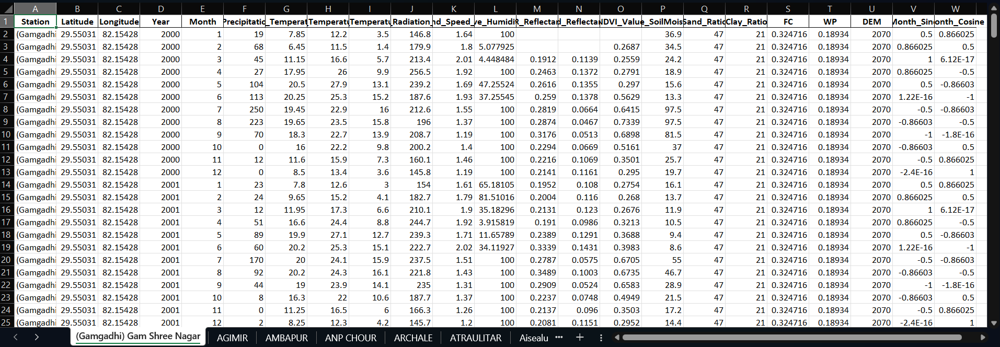
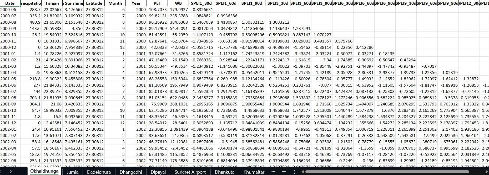

# 🌍 Drought Forecasting and Earth System Modeling Pipeline


An end-to-end automated research pipeline for multi-temporal meteorological drought forecasting, geospatial data extraction, physical index calculation, and deep learning-driven predictive modeling.

## ✨ Key Features
*   **Automated Geospatial Extraction:** Scripts to pull Precipitation, Temperature, and Sunshine data directly from Google Earth Engine (GEE).
*   **Standardized Index Processing:** Automated computation of the Climatic Water Balance (P - PET) and multi-horizon SPEI indices.
*   **Advanced Deep Learning Models:** Built-in architectures for LSTMs, Transformers, and Random Forests tailored for temporal hydro-climatic forecasting.
*   **Visual Analytics:** Direct output visualizations comparing deep learning predictions against actual temporal meteorological variations.

## 🗂️ Repository Architecture

```text
drought-forecasting-pipeline/
├── GEE_data/                        # Public remote sensing datasets & variable dictionary
│   ├── Complete_Station_Data_2000_2...
│   └── README.md
├── Sample_data_DHM/                 # Confidential ground data template & ethics policy
│   ├── dhm_template.csv
│   └── readme.md
├── assets/                          # Visualization outputs, training curves & result figures
│   ├── GEE_downloaded_dataa.png
│   ├── Train_data_output.png
│   └── kathmandu_comparison.png
├── data_extraction/                 # Automated scripts for geospatial data acquisition
│   ├── extract_data.py
│   └── gee_data_download_code.py
├── models/                          # Machine learning and deep learning forecasting architectures
│   └── drought_final_model.py
├── spei_processing/                 # Standardized Precipitation Evapotranspiration Index calculation
│   └── spei_calculator.py
├── README.md 
└── requirements.txt
```

## 🔬 Research Workflow & Methodology

```text
┌─────────────────────────────────────────────────────────┐
│              Google Earth Engine (GEE)                  │
│   Extracts: Precipitation, Tmin, Tmax, Sunshine, Coords │
└────────────────────────────┬────────────────────────────┘
                             │
                             ▼
┌─────────────────────────────────────────────────────────┐
│              Geospatial Data Pipeline                   │
│        (data_extraction/gee_data_download_code.py)      │
│             (data_extraction/extract_data.py)           │
└────────────────────────────┬────────────────────────────┘
                             │
                             ▼
┌─────────────────────────────────────────────────────────┐
│            Multi-Temporal SPEI Processing               │
│        (spei_processing/spei_calculator.py)             │
│      Computes Water Balance (WB = P - PET) & SPEI       │
└────────────────────────────┬────────────────────────────┘
                             │
                             ▼
┌─────────────────────────────────────────────────────────┐
│          Deep Learning & ML Modeling Pipeline           │
│             (models/drought_final_model.py)             │
│         LSTMs, Transformers & Random Forest             │
└────────────────────────────┬────────────────────────────┘
                             │
                             ▼
┌─────────────────────────────────────────────────────────┐
│         Final Drought Forecasting & Analytics           │
│      Generated Outputs stored & rendered as plots       │
└─────────────────────────────────────────────────────────┘
```

## 📊 Pipeline Execution & Results Preview

### 1. Extracted Google Earth Engine Data
Raw extracted meteorological variables, station coordinates, and hydro-climatic features processed from remote sensing sources:



### 2. Multi-Temporal SPEI Processing & Deep Learning Outputs
Processed climatic water balance, PET calculations, multi-horizon SPEI indices, and sequential LSTM/Transformer training metrics:



### 3. Forecasting Performance (Kathmandu Station)
Comparison of deep learning model predictions against actual temporal meteorological variations:
Note: This is the Graph made by DHM data


## ⚙️ Prerequisites & Installation

### Prerequisites
*   Python 3.8 or higher.
*   A registered and authenticated **Google Earth Engine (GEE)** account (required for executing extraction scripts).

### Setup Instructions

```bash
# Clone the repository
git clone [https://github.com/aashutoshaad/drought-forecasting-pipeline.git](https://github.com/aashutoshaad/drought-forecasting-pipeline.git)
cd drought-forecasting-pipeline

# Install required dependencies
pip install -r requirements.txt
```

### Running the Pipeline

```bash
# Step 1: Download GEE data (Ensure you have authenticated GEE locally via `earthengine authenticate`)
python data_extraction/gee_data_download_code.py
python data_extraction/extract_data.py

# Step 2: Compute SPEI indices 
python spei_processing/spei_calculator.py

# Step 3: Train and evaluate drought forecasting models
python models/drought_final_model.py
```

## 🔒 Data Availability & Academic Ethics

To strictly adhere to data licensing policies, confidentiality agreements, and research ethics, datasets are handled through a dual-stream approach:

*   **Google Earth Engine (`GEE_data/`)**: Publicly available remote sensing satellite datasets. Pre-processed station datasets are included or can be re-extracted via `data_extraction/`.
*   **DHM Ground Data (`Sample_data_DHM/`)**: Ground-truth meteorological observation data sourced from the Department of Hydrology and Meteorology (DHM), Nepal. Due to strict institutional confidentiality constraints, full observational datasets are restricted from public release. A dummy schema template (`dhm_template.csv`) is provided strictly for testing execution flow.

## ✉️ Contact & Data Access Requests

For legitimate academic verification, research inquiries, or to request access to the restricted ground-truth DHM dataset, please reach out via email. 

**Email:** [aashutosh.078bce003@acem.edu.np](mailto:aashutosh.078bce003@acem.edu.np)

---
## ⚖️ Copyright & License

© 2026 [Your Name/Aashutosh]. **All Rights Reserved.**

This project, including all source code, scripts, deep learning models, and documentation, is strictly proprietary and confidential. 

**You may NOT use, copy, modify, distribute, reproduce, or publish any part of this repository in any form without explicit written permission from the author.** 

For collaboration or permission requests, please contact the author directly via the email provided above.
